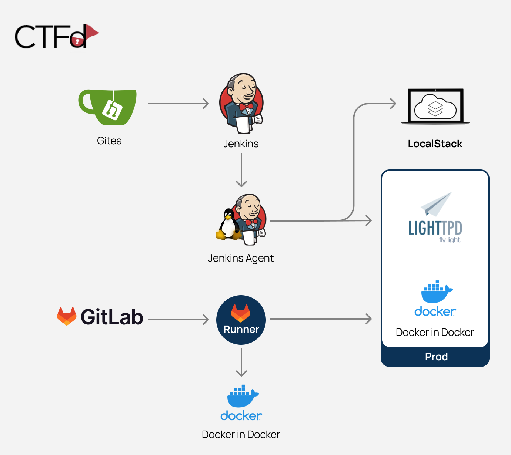

[](https://www.paloaltonetworks.com/prisma/cloud/cloud-code-security)

[](https://www.paloaltonetworks.com/prisma/cloud/cloud-code-security)
[](https://owasp.org/www-project-top-10-ci-cd-security-risks/)
[](https://github.com/cider-security-research/cicd-goat/actions/workflows/release.yaml)
[](https://circleci.com/gh/cider-security-research/cicd-goat/tree/main)


Deliberately vulnerable CI/CD environment.
Hack CI/CD pipelines, capture the flags. :triangular_flag_on_post:

Created by Cider Security [(Acquired by Palo Alto Networks)](https://www.paloaltonetworks.com/prisma/cloud/cloud-code-security).

## Table of Contents

* [Description](#Description)
* [Download & Run](#Download--Run)
  * [Linux & Mac](#Linux--Mac)
  * [Windows (Powershell)](#Windows-Powershell)
* [Usage](#Usage)
  * [Instructions](#Instructions)
  * [Take the challenge](#Take-the-challenge)
  * [Troubleshooting](#Troubleshooting)
* [Solutions](#Solutions)
* [Contributing](#Contributing)

## Description
The CI/CD Goat project allows engineers and security practitioners to learn and practice CI/CD security through a set of 11 challenges, enacted against a real, full blown CI/CD environment. The scenarios are of varying difficulty levels, with each scenario focusing on one primary attack vector.

The challenges cover the [Top 10 CI/CD Security Risks](https://owasp.org/www-project-top-10-ci-cd-security-risks/), including Insufficient Flow Control Mechanisms, PPE (Poisoned Pipeline Execution), Dependency Chain Abuse, PBAC (Pipeline-Based Access Controls), and more.\
The different challenges are inspired by Alice in Wonderland, each one is themed as a different character.

The project’s environment is based on Docker containers and can be run locally. These containers are: 
1. Gitea (minimal git server)
2. Jenkins
3. Jenkins agent
4. LocalStack (cloud service emulator that runs in a single container)
5. Prod - contains Docker in Docker and Lighttpd service 
6. CTFd (Capture The Flag framework)
7. GitLab
8. GitLab runner
9. Docker in Docker

The images are configured to interconnect in a way that creates fully functional pipelines.

[](#)

## Download & Run
**There's no need to clone the repository.**

### Linux & Mac
```sh
curl -o cicd-goat/docker-compose.yaml --create-dirs https://raw.githubusercontent.com/cider-security-research/cicd-goat/main/docker-compose.yaml
cd cicd-goat && docker compose up -d
```

### Windows (Powershell)
```PowerShell
mkdir cicd-goat; cd cicd-goat
curl -o docker-compose.yaml https://raw.githubusercontent.com/cider-security-research/cicd-goat/main/docker-compose.yaml
get-content docker-compose.yaml | %{$_ -replace "bridge","nat"}
docker compose up -d
```

## Usage
### Instructions
* **Spoiler alert!** Avoid browsing the repository files as they contain spoilers.
* To configure your git client for accessing private repositories we suggest cloning using the http url.
* In each challenge, find the flag - in the format of _flag#_ (e.g _flag2_), or another format if mentioned specifically.
* Each challenge stands on its own. Do not use access gained in one challenge to solve another challenge.
* If needed, use the hints on CTFd.
* There is no need to exploit CVEs.
* No need to hijack admin accounts of Gitea or Jenkins (named "admin" or "red-queen").

### Take the challenge
1. After starting the containers, it might take up to 5 minutes until the containers configuration process is complete.
2. Login to CTFd at http://localhost:8000 to view the challenges:
   * Username: `alice`
   * Password: `alice`

3. Hack:
   * Jenkins http://localhost:8080
     * Username: `alice`
     * Password: `alice`
   * Gitea http://localhost:3000
     * Username: `thealice`
     * Password: `thealice`
   * GitLab http://localhost:4000
     * Username: `alice`
     * Password: `ali12345`

4. Insert the flags on CTFd and find out if you got it right.

### Troubleshooting
* If Gitea shows a blank page, refresh the page.
* When forking a repository, don't change the name of the forked repository.
* If any of the services doesn't start or is not configured correctly try adding more cpu and memory to the docker engine and update it to the lateset version.

## Solutions
**Warning:** Spoilers! :see_no_evil:

* See [Solutions](solutions).
* BSidesLV talk: [Climbing the Production Mountain: Practical CI/CD Attacks Using CI/CD Goat](https://www.youtube.com/watch?v=w-R2PT2jfdU) - Featuring solutions of the Caterpillar, Mock Turtle and Dormouse challenges.  

## Contributing
See [Contributing](CONTRIBUTING.md).
