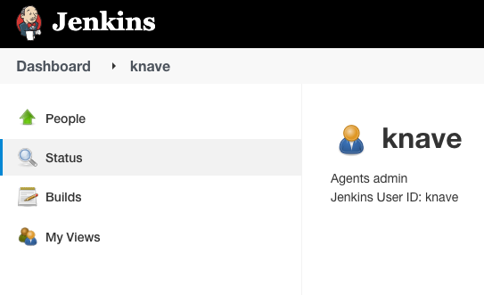
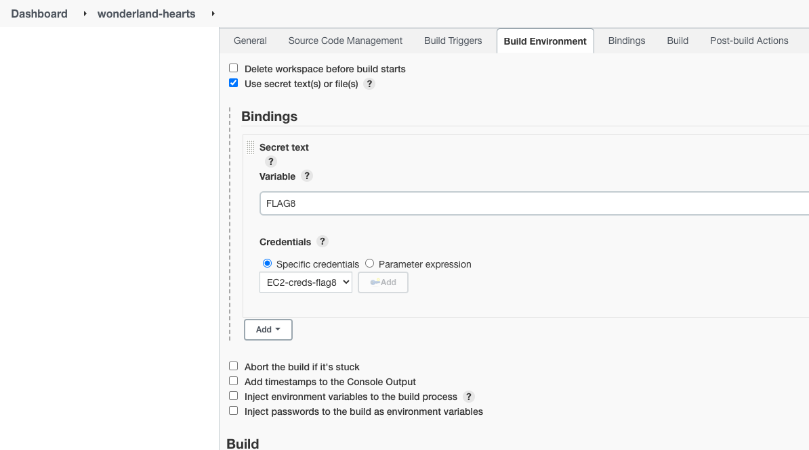
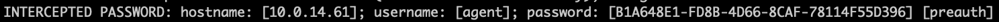
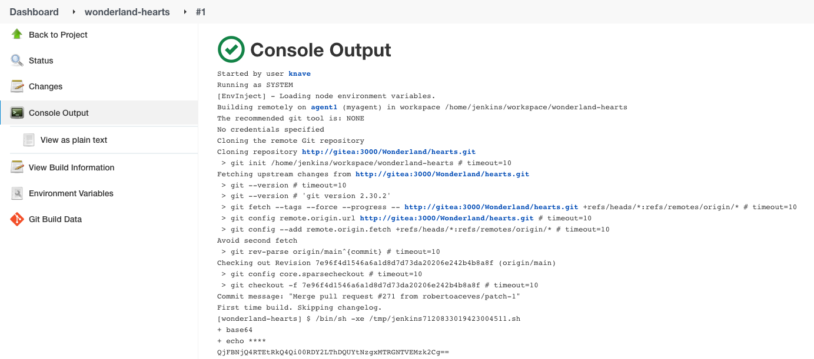

[](https://www.cidersecurity.io/top-10-cicd-security-risks/inadequate-identity-and-access-management/?utm_source=github&utm_medium=github_page&utm_campaign=ci%2fcd%20goat_100422)

Identify the user that has privileged access to the Hearts Jenkins pipeline. Looking at the list of Jenkins users shows a short list of users, one of them is Knave - whose description reveals that it’s the job owner. Sounds like a place to start from.

The users in this Jenkins instance are managed by Jenkins’ own user database, which lacks basic security controls against various types of attacks. It means that you can brute force the Knave user to find its password. Then, you’d be able to modify the Hearts pipeline and exfiltrate the system credentials.


1. Login to Jenkins with alice.
2. Browse to the People page on the top left corner and click on Knave to read its description, which reveals it’s the owner of the Hearts job.

3. Brute force Knave’s password on Jenkins. You can use the Rockyou list. Password is _rockme_.
4. Configure the Hearts pipeline to load the flag: Under “Build Environment”, check “Use secret text(s) or file(s)”, add a secret text, and under “Specific credentials” choose “EC2-creds-flag8”.

5. Add a shell command to print the flag:

    ```bash
    echo "$FLAG" | base64
    ```
    

6. Manually trigger the pipeline.
7. Access the console output of the executed job to get the encoded secret.
