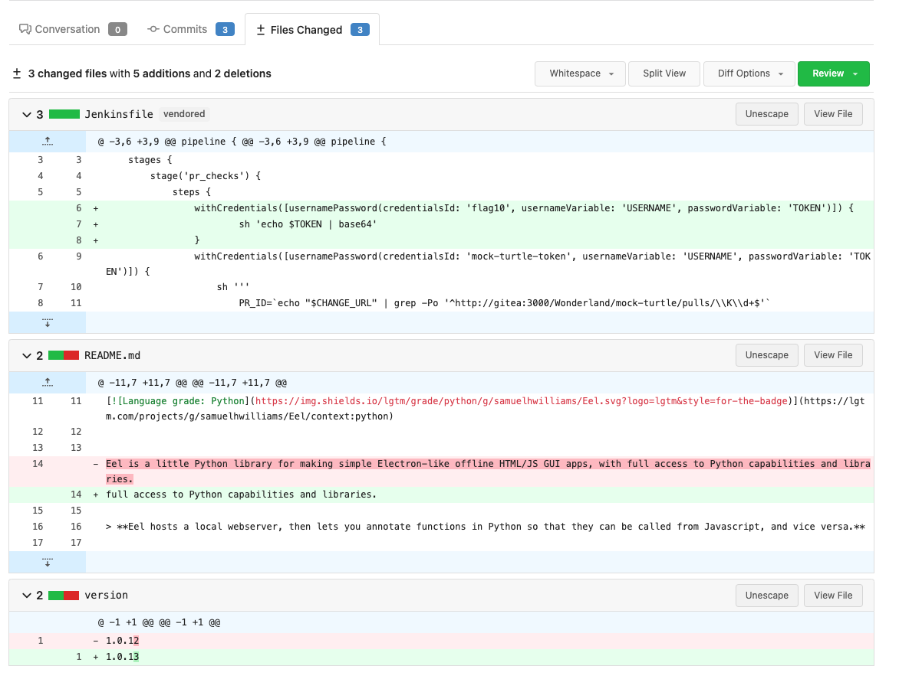
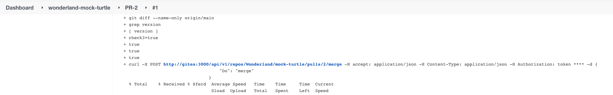
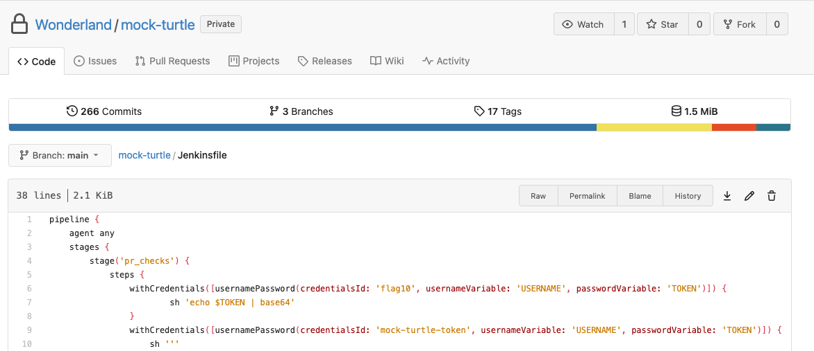
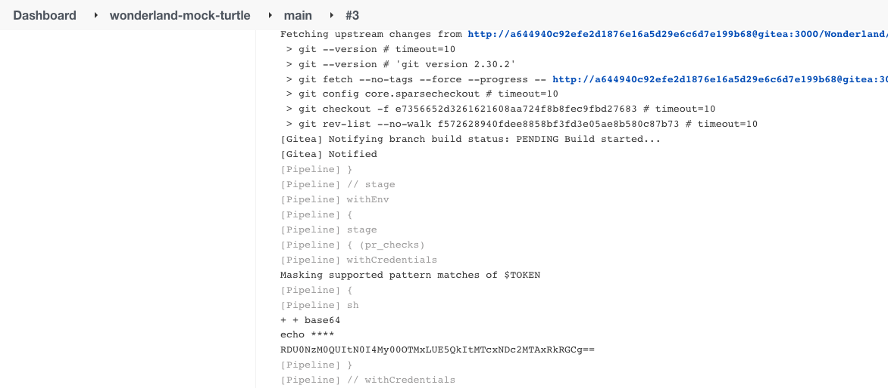

[](https://www.cidersecurity.io/top-10-cicd-security-risks/insufficient-flow-control-mechanisms/?utm_source=github&utm_medium=github_page&utm_campaign=ci%2fcd%20goat_100422)

The _mock-turtle_ pipeline is used to automatically merge code into the main branch if it introduces just a version bump (stored in the _version _file). The auto-merge code can be bypassed to merge malicious code into the main branch. The code was inspired by this [blog post](https://blog.ryotak.me/post/homebrew-security-incident-en/) by Ryotak, and this [Stack Overflow answer](https://stackoverflow.com/a/31823590/6691195) about counting words diff.

The auto-merge code checks for three conditions that should be met:


1. No words are added in the pull request. When just the version is updated, one line (and word) is considered removed by the git diff check, and one word is added, so 0 words are added or removed in total.
2. Version structure is left the same.
3. Version file is changed.

The first condition naively checks that no new words were added in the pull request - as only the version itself should be modified. However, the attacker can add his payload in the Jenkinsfile - and delete an equivalent number of words from any other file in the repo, so the total number of changed words will be zero.

The second and third conditions are easy to meet. Just change one of the numbers in the version file, and keep its structure. The problem with the third condition is that while it checks for a change in the version file, it doesn’t verify that it’s the only file that is changed.

To access the flag, the attacker can do as follows:


1. Checkout to a new branch.
2. Modify the version file, so its structure would stay valid (like 1.2.3).
3. Modify the Jenkinsfile to access the flag.


    ```groovy
    withCredentials([usernamePassword(credentialsId: 'flag10', usernameVariable: 'USERNAME', passwordVariable: 'TOKEN')]) {
        sh 'echo $TOKEN | base64'
    }
    ```


4. In addition, remove an identical number of words from anywhere in the repository as in the code appended to the Jenkinsfile, to bypass condition #1.
5. Create a pull request from the new branch to main.

6. The pipeline is triggered, merging the pull request automatically.


7. The pipeline is triggered again, this time on the main branch, exposing the code in the job’s console output.
