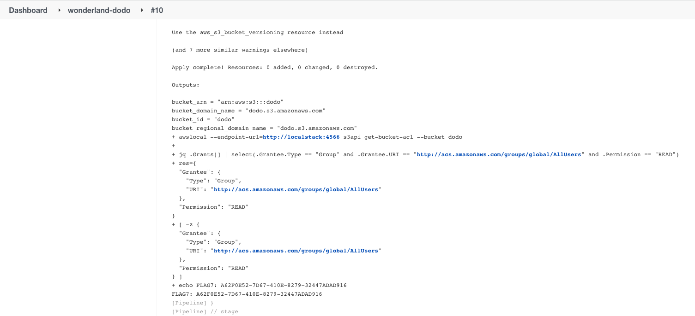

[](https://owasp.org/www-project-top-10-ci-cd-security-risks/CICD-SEC-01-Insufficient-Flow-Control-Mechanisms)

Running security scans in CI pipelines is a common practice. [Checkov](https://github.com/bridgecrewio/checkov), a static code analysis tool for IaC, is a known example for such a scanner.

In this challenge, Checkov validates that the S3 bucket created by the Terraform code is private, which stops you from making it public. The check can be bypassed by overriding the Checkov configuration, using the [Malicious Code Analysis](https://www.cidersecurity.io/blog/research/malicious-code-analysis-abusing-sast-misconfigurations-to-hack-ci-systems/?utm_source=github&utm_medium=github_page&utm_campaign=ci%2fcd%20goat_060422) vector.

1. Clone the _Wonderland/dodo_ repository.
2. Modify the ACL of the _dodo_ S3 bucket under _main.tf_ to: 

    ```json
    acl           = "public-read"
    ```


3. Create a file named _.checkov.yaml_ with the following content. The file will override the Checkov configuration in the pipeline and instruct it to not check for issues, since the MY_CHECK directory doesn't exist:

    ```yaml
    soft-fail: true
    check:
      - MY_CHECK
    ```


4. Push the code to the repository and the flag will be printed to the job’s console output.

