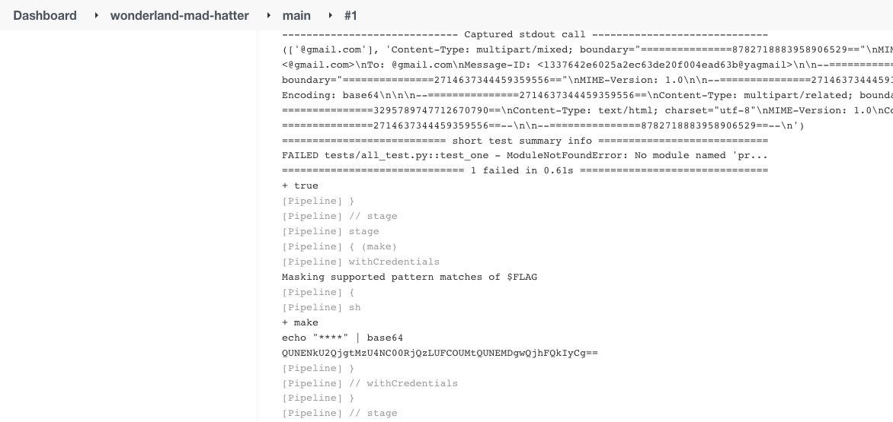

[-brightgreen)](https://owasp.org/www-project-top-10-ci-cd-security-risks/CICD-SEC-04-Poisoned-Pipeline-Execution)

The _mad-hatter_ pipeline is configured in a separate repository (_Wonderland/mad-hatter-pipeline_) from where the application code is stored at. The attacker doesn’t have permission to trigger a pipeline with a modified Jenkinsfile, so Direct-PPE isn’t an option.

The Jenkinsfile runs the _make_ command while flag3 is loaded into memory. Execute an [Indirect-PPE](https://www.cidersecurity.io/blog/research/ppe-poisoned-pipeline-execution/?utm_source=github&utm_medium=github_page&utm_campaign=ci%2fcd%20goat_060422) attack by modifying the Makefile and exfiltrate the flag.


1. Modify the Makefile in the main branch under the _Wonderland/mad-hatter_ repository to print _flag3_ to the console output of the Jenkins job (or send it to a host you control).


    ```Makefile
    whoami:
        echo "${FLAG}" | base64
    ```


2. A pipeline will be triggered automatically. Access the console output of the executed job to get the encoded secret.
